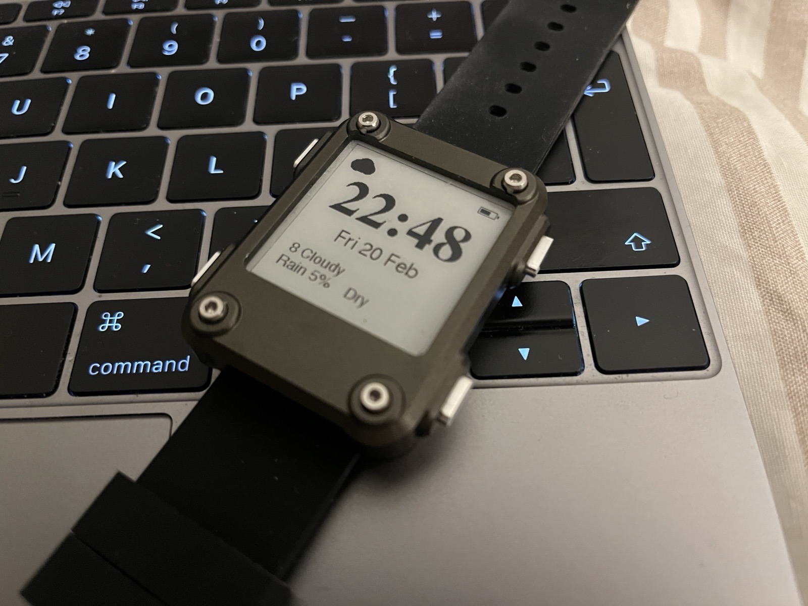
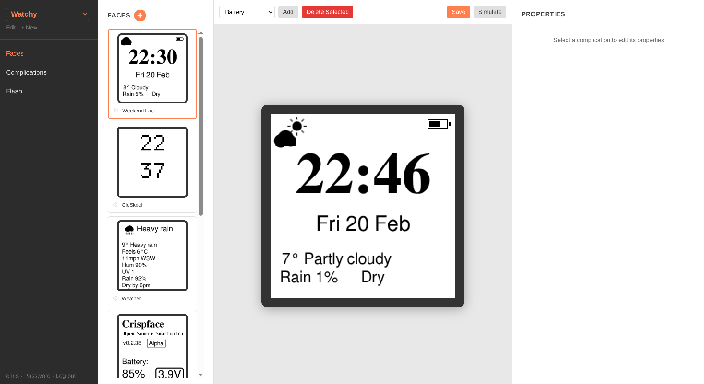
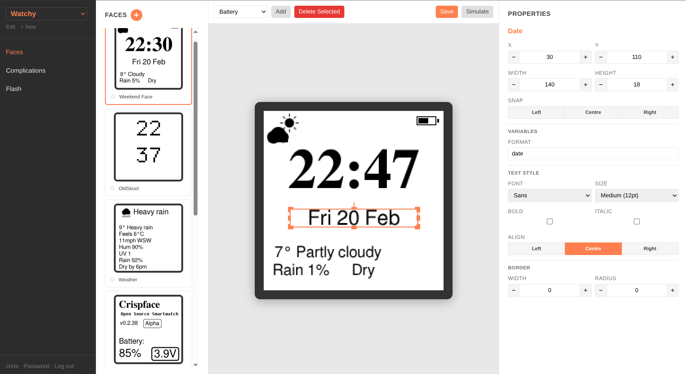
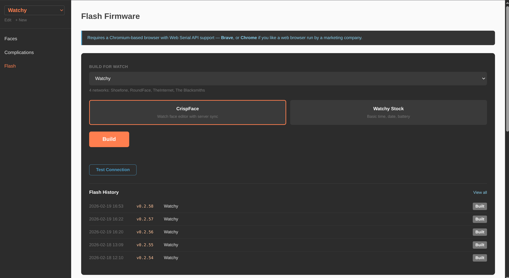

# CrispFace

A custom watch face editor and firmware for the [Watchy](https://watchy.sqfmi.com/) ESP32-S3 e-paper smartwatch by [SQFMI](https://github.com/sqfmi/Watchy).

Design watch faces in a browser, flash the firmware once over USB, and you're done — the watch syncs face layouts, complication data, and even WiFi credentials over the air. Edit a face, rearrange complications, add a new calendar feed, whatever — the watch picks up the changes on its next WiFi sync. No need to plug it in again.



The server does all the heavy lifting. It resolves weather, calendar events, and other dynamic data before sending anything to the watch. The watch is a thin client — it renders what it's told and goes back to sleep.

CrispFace extends the [stock Watchy firmware](https://github.com/sqfmi/Watchy) — the `CrispFace` class inherits from `Watchy` and overrides `drawWatchFace()` and `handleButtonPress()` to add server-synced faces, complications, and alerts. Everything else — deep sleep, RTC alarms, the settings menu, NTP time sync — comes from the Watchy base class.

## How It Works

```
┌─────────────────┐         ┌─────────────┐
│  Python CGI API │ ◄─────► │  Web Editor  │
│  (via router.php)│         │  (Fabric.js) │
└────────┬────────┘         └─────────────┘
         │
         │ JSON over HTTPS
         ▼
   Watchy Devices
```

The web editor gives you a 200x200 pixel [Fabric.js](http://fabricjs.com/) canvas — the exact resolution of the watch's 1-bit e-paper display. You place text complications (time, date, weather, calendar events, etc.), choose fonts and sizes, and save. The editor uses pre-computed Adafruit GFX font metrics to match the firmware's pixel-level rendering.

The watch wakes every 60 seconds (Watchy's built-in RTC alarm) and on any button press. Each wake, it checks whether its cached data is stale and syncs from the server if needed. WiFi is connected only for the duration of the HTTPS request, then killed immediately. Faces are cached on SPIFFS, so even without WiFi the watch keeps showing the last-synced data.

### Sync Timing

Each complication has its own refresh interval (configured in the editor, in minutes). The firmware's auto-sync interval is driven by the shortest refresh interval across all server-side complications on the current watch — so a face with a 1-minute weather update and a 30-minute calendar will sync every 60 seconds. If a watch only has local complications (time, date, battery), the firmware skips server syncs entirely and just re-renders from hardware — no WiFi, maximum battery life. You can always force an immediate sync by pressing top-left regardless of the interval.

## Features

- **Visual face editor** — Fabric.js canvas with pixel-accurate bitmap font preview matching the watch display
- **Complication system** — time, date, battery, weather (Open-Meteo + Met Office), ICS calendars, static text, firmware version
- **Calendar alerts** — gentle buzz or insistent privacy-first buzz, with configurable pre-alert timing per feed
- **Multiple faces** — design as many as you want, assign them to a watch, cycle through them on-device
- **Per-watch WiFi** — up to 5 networks per watch, firmware scans and connects to the strongest available
- **OTA config** — WiFi credentials and face changes are synced over the air, no reflashing needed
- **Build-on-demand** — compile firmware from the browser, flash via Web Serial (Chrome/Edge)
- **Multi-user** — admin and user roles, flat-file JSON storage, no database required
- **Per-complication refresh intervals** — each complication has its own refresh rate; the firmware auto-syncs based on the shortest one, keeping WiFi usage (and battery drain) to the minimum needed
- **Stale data indication** — server complications past their freshness window render in fake italic (per-row pixel shear)
- **Parallel source resolution** — server fetches weather, calendar, etc. concurrently during sync for faster responses

## Complications

| Source | Description | API Key? |
|---|---|---|
| Time / Date | Rendered on-device from RTC hardware | No |
| Battery | Voltage from ADC, rendered on-device | No |
| Weather (Open-Meteo) | Free global weather, no account needed | No |
| UK Weather (Met Office) | Met Office DataHub, UK town lookup | Yes |
| ICS Calendar | Multi-feed with per-feed bold, alerts, and recurring event support | No |
| Text | Static text passthrough | No |
| Version | Firmware version string, rendered on-device | No |

New complication sources are Python CGI scripts that return `{"value": "..."}`. See [Documentation/complications.md](Documentation/complications.md).

## Tech Stack

- **Server**: PHP (page serving, firmware builds), Python 3 CGI (all API endpoints, routed via `router.php`)
- **Editor**: [Fabric.js](http://fabricjs.com/) canvas, vanilla JS, canvas 2D text rendering with GFX metrics lookup
- **Storage**: Flat-file JSON in `data/` — no MySQL, no Redis, no external dependencies
- **Firmware**: C++ on ESP32-S3 (PlatformIO), single `main.cpp`, extends [SQFMI's Watchy](https://github.com/sqfmi/Watchy) base class
- **Fonts**: FreeSans, FreeSerif (regular + bold, 9/12/18/24/36/48pt) + Tamzen bitmap monospace (regular + bold, all sizes)

## Project Structure

```
crispface/
├── api/                    # Python CGI + PHP endpoints
│   ├── router.php          # Routes *.py requests through Python CGI
│   ├── watch_faces.py      # Firmware sync endpoint (Bearer auth)
│   ├── build_firmware.php  # Build-on-demand (auto version bump)
│   └── sources/            # Complication data source scripts
├── lib/                    # Shared Python (auth, config, JSON storage)
├── data/                   # Flat-file JSON storage (gitignored)
├── firmware/               # ESP32-S3 PlatformIO project
│   ├── src/main.cpp        # The entire firmware
│   ├── include/            # config.h, fonts.h, custom font headers
│   └── platformio.ini      # Two envs: watchy, stock
├── js/ css/                # Frontend assets
├── Documentation/          # Specs and guides
├── editor.html             # Fabric.js face editor (main UI)
├── flash.html              # Build & flash via Web Serial
├── faces.html              # Face management
├── complications.html      # Complication type management
├── watch-edit.html         # Watch settings + WiFi
└── users.html              # User management (admin)
```

## Dependencies

**Server:**
- Apache 2.4+ with PHP 8.4+
- Python 3 with `python3-bcrypt`

**Firmware builds:**
- PlatformIO (`pip install platformio`)

**Font generation (optional — only for adding new font sizes):**
- `pkg-config`, `libfreetype-dev`, `gcc`

See [Documentation/dependencies.md](Documentation/dependencies.md) for the full list.

## Getting Started

1. Clone the repo and point Apache at the `crispface/` directory
2. Copy `firmware/include/config.h.example` to `config.h` and fill in your server URL
3. Create a `data/` directory (the app will populate it on first use)
4. Log in, create a watch, design a face, build and flash

The initial flash requires Chrome or Edge (Web Serial API). Put the watch into bootloader mode — hold the top-left button while plugging in USB. Use a data cable, not a charge-only one.

After that first flash, all face design changes sync to the watch over WiFi automatically. Press top-left on the watch to force an immediate sync, or just wait — the firmware syncs on its own when cached data goes stale.

## Button Layout

```
[top-left: Sync]        [top-right: Prev face]

[bottom-left: Menu]     [bottom-right: Next face]
```

- **Top-left**: manual sync. Double-press within 4s for full display refresh (clears e-paper ghosting). Long hold (1.5s) for debug sync screen.
- **Top-right / Bottom-right**: cycle through faces (wraps around).
- **Bottom-left**: stock Watchy menu (set time, buzzer, etc.)

## Documentation

### Screenshots







- [Web Builder Spec](Documentation/crispface-web-builder-spec.md)
- [Firmware Spec](Documentation/crispface-firmware-spec.md)
- [Developing Complications](Documentation/complications.md)
- [Dependencies](Documentation/dependencies.md)

## Status

Active development. Currently at v0.2.x — text complications are solid, calendar alerts work, build-and-flash pipeline is reliable. Bitmap/image complications, QR codes, and OTA firmware updates are on the list but not yet started.

## Licence

This is a personal project. No licence yet.
